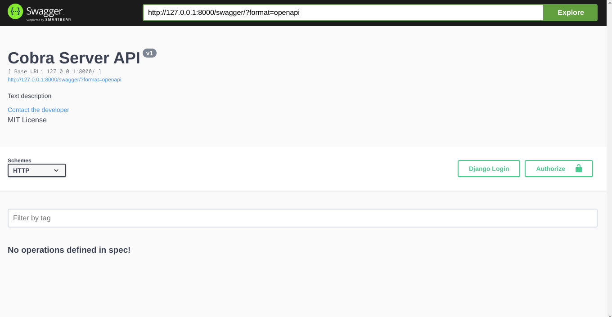

<div align="center">
  
# KOBRA


</div>

Cloneable referential to initialize a custom server program based
on the **Django framework** designed 
to allow a programmer to directly move to the implementation of 
an application's features without having to torture himself with other
time-consuming configuration or installation.

**Table of Contents**

- [Description](#description):  contents the project description.
- [Features](#features): contents the descriptions of each features implemented and available on this software.
- [Installation](#installation): contents the process of the installation for two plateforms.
  - [1. Database](#1-database): Database management system installation and database setting.
    - [1.1. PostgreSQL](#11-postgresql): Support for PostgreSQL database manager.
  - [2. Application server](#2-application-server)
    - [2.1. OS dependences](#21-os-dependences): Installation of your Linux OS dependences.
      - [2.1.1. Ubuntu](#211-ubuntu): Choose this, if your OS is Ubuntu.
      - [2.1.2. Debian or Kali](#212-debian-or-kali): Otherwise, choose this, if your OS is Debian or Kali.
    - [2.2. Repository dependences](#22-repository-dependences): To install the dependences for this project.
      - [2.2.1. Database setting](#221-database-setting): To install database manager and setting the application database.
        - [(a) PostgreSQL](#a-postgresql): Setting of the database of PostgreSQL for application server.
      - [2.2.2. Server setting](#222-server-setting): To install the dependences of the Python server of application.
- [Usage](#usage): all details of the use cases usefull to get starting this software. 
- [Tests](#tests): all details to run unittest.
- [To contribute](#to-contribute): usefull information for the person who want to contribute to this project.
- [Licence](#licence): description of the license of this software.
- [Contact](#contact): developers contacts.


## Description

My Python project is a simple application that allows users to create, read,
update and delete the tasks. It is designed to be easy to use and expand.

## Features

- **Django REST Framework**: it's a powerful and flexible toolkit
for building Web APIs.
-  **drf-spectacular**: for the generation of a documentation of the API
in real **Swagger/OpenAPI 2.0 specifications**
from a **Django Rest Framework** API.
- **Django CORS Headers**: it's a security mechanism that
**allows one domain to access** resources hosted on **another domain**.

## Installation
To install the project, make sure you have **Python 3.10** or later version
and `pip` installed on your machine. And then you can pass to the following
steps.

We must install three (03) programs:
1. `Python3` runtime;
2. Python virtual environment `venv`;
3. Database manager `PostgreSQL`;
4. Getting of project repository.

### 1. Database
#### 1.1. PostgreSQL
To install this database manager, run the following command line of APT.

```sh
sudo apt install postgresql postgresql-contrib
```

The following `SQL` command lines allow to create a `PostgreSQL`
database for your application:

```sh
# To connect to PostgreSQL with ROOT user:
sudo su - postgres
```

To connect to default database (postgres):

```sh
psql
```

Given your database name is `kbrdb` and the username is `kobra`.

```sql
CREATE DATABASE kbrdb;
CREATE USER kobra WITH ENCRYPTED PASSWORD 'your-secret-password-here';
ALTER ROLE kobra SET client_encoding TO 'utf8';
ALTER ROLE kobra SET default_transaction_isolation TO 'read committed';
ALTER ROLE kobra SET timezone TO 'Europe/Paris';
GRANT ALL PRIVILEGES ON DATABASE kbrdb TO kobra;

-- configuration for testing database for Django
ALTER USER kobra CREATEDB;
-- ALTER ROLE kobra SUPERUSER;

-- connect to kbrdb.
\c kbrdb;

```

Give the access of the `public` schema to the user account of the application.

```sql
GRANT ALL ON SCHEMA public TO kobra;
```

### 2. Application server

```bash
git clone https://github.com/mokira3d48/kobra.git myapp && cd myapp
cd myapp;
sudo rm -r .git;
git init;  # To create a new instance of git repository
```

#### 2.1. OS dependences

##### 2.1.1. Ubuntu
If you are using *Ubuntu* system,
open your terminal and run following command lines
to add the deadsnakes PPA to your system:

```sh
sudo apt update;
sudo apt install software-properties-common -y;
sudo add-apt-repository ppa:deadsnakes/ppa -y

```

Refresh your package list to include the deadsnakes PPA
and then install Python 3.10:

```sh
sudo apt update;
sudo apt install python3.10;
python3.10 --version
```

> **NOTE**: Do not change the default Python version of Ubuntu,
> as it may break system tools that depend on it.

##### 2.2.2. Debian or Kali
If you are using *Debian* or *Kali linux*,
in first, install the following dependences on your computer.

```sh
sudo apt install build-essential zlib1g-dev libncurses5-dev libgdbm-dev libnss3-dev libssl-dev libreadline-dev libffi-dev libsqlite3-dev wget libbz2-dev
```

And then, we can run the following command to install `pyenv`
directly via APT on your computer.

```sh
sudo apt install pyenv
```

Or run the following command lines, to clone and install
`pyenv` from its souce code.

```sh
git clone https://github.com/pyenv/pyenv.git ~/.pyenv;
 
echo 'export PYENV_ROOT="$HOME/.pyenv"' >> ~/.bashrc;
echo 'export PATH="$PYENV_ROOT/bin:$PATH"' >> ~/.bashrc;
echo 'eval "$(pyenv init --path)"' >> ~/.bashrc;
echo 'eval "$(pyenv init -)"' >> ~/.bashrc;
source ~/.bashrc;
```

Now, runing the following command line, we can use `pyenv`
to install the version of Python what we want to install.

```sh
pyenv install 3.10.18;  # Here, we install Python 3.10.18.
sudo ln -s $HOME/.pyenv/versions/3.10.18/bin/python3 /usr/local/bin/python3.10
```

#### 2.2. Repository dependences

##### 2.2.1. Database setting

###### (a) PostgreSQL
Insert the following information into `server/.env_example` file:

| FIELDS   | VALUES                    | DESCRIPTION            |
| ------   | --------------------------|------------------------|
| DB_NAME  | kbrdb                     | Database name.         |
| USERNAME | kobra                     | User name of database. |
| PASSWORD | your-secret-password-here | User password.         |
| HOST     | 127.0.0.1                 | The access hostname to connect to the database. |
| PORT     | 5432                      | The access PORT to connect to the database. |

Here are the contents of the file `server/.env_example`:

```
DB_NAME=kbrdb
USERNAME=kobra
PASSWORD=your-secret-password-here
HOST=127.0.0.1
PORT=5432

# And others settings...

```


##### 2.2.2. Server setting

1. `sudo apt install cmake python3-venv` Install *Cmake* and *Virtual env*;
2. `python3 -m venv .venv` create a virtual env into directory
named `.venv`;
3. `cp server/.env_example server/.env` to create a `.env` file in the root
of the server from the `server/.env_example`:
4. `source .venv/bin/activate` activate the virtual environment named `.venv`;
5. `make install` install the requirements of this package;
6. `make dev_install` or `pip install -e .` install the package in dev mode
in virtual environment;
7. `make messages` to update translations after adding new text
8. `make build` to build application translation for i18n;
9. `make migrations` to migrate the data models into the database;
10. `make sudo` or `manage createsuperuser` to create a super user to access
to the Admin space;
11. `make run` to start the application server.

You will see:

```
hostname -I
192.168.100.6 
#.venv/bin/python3 server/manage.py runserver 0.0.0.0:8000
.venv/bin/manage runserver 0.0.0.0:8000
2025-09-26 15:31:23,452 [    INFO] Loading setting ... (settings.py:31)
2025-09-26 19:31:23,710 [    INFO] Loading setting ... (settings.py:31)
Performing system checks...

System check identified no issues (0 silenced).
September 26, 2025 - 19:31:23
Django version 5.0, using settings 'core.settings'
Starting development server at http://0.0.0.0:8000/
Quit the server with CONTROL-C.

```

All work with successfully ! <br/>
To access it in this cas, you must execute the following command line,
in first:

```sh
# ~$
# IF YOU ARE USING LINUX
# show your IP address of your machine, if it's connected
# to your local network for example.
ifconfig
```

> For the people using **Windows**, use `ipconfig` insted of the command line
> above.

We cant go it at this local host **http://localhost:8000**.




### Docker onfiguration

To build an image of this project, run the following command line:

```sh
# ~$
docker build -t kobra-server:1 .
```

```bash
# ~$

```

To run a container from existing built image, you can run the following example:

```sh
# ~$
docker build -t kobra-server:1 .

docker run -d --rm -p 8000:8000 --name kobra-web-1 -v $(pwd):/app -e "DJANGO_SETTINGS_MODULE=core.prod_settings" kobra-server:1
docker run -d --rm -p 8000:8000 --name kobra-web-1 -v $(pwd):/app kobra-server:1 python -m manage runserver 0.0.0.0:8000

docker exec -it kobra-web-1 python -m manage createsuperuser
docker exec -it kobra-web-1 python -m manage makemigrations
docker exec -it kobra-web-1 python -m manage migrate
docker exec -it kobra-web-1 python -m manage collectstatic

docker exec -it  kobra-web-1 bash
```

```bash
# ~$
docker build -t postgres-kbrdb:16 database/
docker run -d --rm --name kbrdb-postgres -p 5432:5432 -e POSTGRES_PASSWORD=master_root_password -v kbrdb_data:/var/lib/postgresql/data postgres-kbrdb:16
docker exec db pg_dump -U kobra_user kobra_db > backup.sql
docker exec -T db psql -U kobra_user kobra_db < backup.sql
docker exec -it kbrdb-container psql -U kobra -d kbrdb

psql -h localhost -p 5432 -U kobra -d kbrdb
```

To execute a command line directly on the container in running:

```bash
# ~$
docker stop kobra-web-1
docker image rm kobra-server:1
```

```shell
# ~$
docker stop kbrdb-postgres
docker image rm postgres-kbrdb:16
```

> `kobra-web-1` represents the name of the container that you can obtain
> running the following command line: `docker container ls`.

```
CONTAINER ID   IMAGE       COMMAND                  CREATED          STATUS          PORTS                                         NAMES
cbb6dbbf0816   kobra-web   "/app/entrypoint.sh …"   12 minutes ago   Up 12 minutes   0.0.0.0:8080->8080/tcp, [::]:8080->8080/tcp   kobra-web-1

```

- To list all images availables: `docker image ls`
- To list all containers running: `docker container ls`.
- To list all containers (running and stopped): `docker ps -a`.
- To **stop** a running container: `docker stop kobra-web-1`.
- To **remove** a stopped container: `docker rm kobra-web-1`.

- To access PostgreSQL shell:

```sh
# ~$
docker compose exec db psql -U kobra_user -d kobra_db
```

- To view database logs:

```sh
# ~$
docker compose logs db
```

- To backup database

```sh
# ~$
docker compose exec db pg_dump -U kobra_user kobra_db > backup.sql
```

- To restore database:

```sh
# ~$
docker compose exec -T db psql -U kobra_user kobra_db < backup.sql
```


## Usage

This Makefile provides a comprehensive set of commands for managing
a Django web application with internationalization (i18n) support.
It automates environment setup, dependency management, database operations,
and server execution.


### Directory Configuration
- `BASE_DIR = server` - Root directory of the Django project
- `VENV_DIR = .venv` - Python virtual environment directory
- `VENV_BIN = $(VENV_DIR)/bin` - Path to virtual environment binaries

### Server Configuration
- `HOST = 0.0.0.0` - Server host address (accessible from any network interface)
- `PORT = 8000` - Server port number


### `install`
**Purpose**: Complete project setup and dependency installation

**Steps**:
1. **System Dependencies**: Installs required system packages:
   - `build-essential`: Compilation tools
   - `gettext`: Internationalization utilities
   - `python3-dev`: Python development headers
   - `libpq-dev`: PostgreSQL development libraries
   - `libsqlite3-dev`: SQLite development libraries
   - `python3-django`: Django framework (system package)

2. **Virtual Environment**: Creates Python virtual environment if it doesn't exist

3. **Directory Setup**: Creates essential directories in the project:
   - `static/` - Static files (CSS, JS, images)
   - `media/` - User-uploaded files
   - `locale/` - Translation files

4. **Python Environment**:
   - Verifies Python version
   - Upgrades pip to latest version
   - Installs project dependencies from requirements.txt

**Usage**: `make install`


### `dev_install`
**Purpose**: Development-specific installation (minimal setup)

**Steps**:
- Verifies Python version
- Installs current project in editable mode (`-e .`)

**Note**: Pip upgrade is commented out for faster development cycles

**Usage**: `make dev_install`


### `messages`
**Purpose**: Generate translation files for internationalization

**Steps**:
- Creates/updates message files for:
  - English (`-l en`)
  - French (`-l fr`)

**Usage**: `make messages`

### `build`
**Purpose**: Compile translation files for production use

**Steps**:
- Compiles `.po` translation files into optimized `.mo` files

**Usage**: `make build`


### `migrations`
**Purpose**: Database migration management

**Steps**:
1. `makemigrations` - Creates new migration files from model changes
2. `migrate` - Applies pending migrations to the database

**Usage**: `make migrations`


### `sudo`
**Purpose**: Create Django superuser account

**Steps**:
- Runs `createsuperuser` command to set up admin user

**Usage**: `make sudo`


### `run`
**Purpose**: Start Django development server

**Steps**:
1. Displays server IP addresses using `hostname -I`
2. Starts development server on configured host and port

**Access**: Server will be available at `http://0.0.0.0:8000`

**Usage**: `make run`


### `test`
**Purpose**: Execute project tests

**Steps**:
- Runs pytest test suite from current directory

**Usage**: `make test`


### `shell`
**Purpose**: Launch Django interactive shell

**Steps**:
- Starts Django shell with project environment loaded

**Usage**: `make shell`

Usage Examples:

1. Initial Project Setup
```bash
make install        # Complete environment setup
make migrations     # Set up database
make sudo          # Create admin user
make run           # Start server
```

2. Development Workflow
```bash
make dev_install    # Quick development setup
make messages       # Update translations after adding new text
make build         # Compile translations
make test          # Run tests
```

### Important Notes

1. **Virtual Environment**: All Python commands use the project's virtual environment
2. **Database Support**: Configured for both PostgreSQL (`libpq-dev`) and SQLite (`libsqlite3-dev`)
3. **Network Access**: Server runs on `0.0.0.0` making it accessible from other devices on the network
4. **Internationalization**: Supports multi-language content (English and French)
5. **Django Commands**: Uses `django-admin` for project-agnostic tasks and `manage` for project-specific operations

### Minimal File Structure Assumption
The Makefile assumes this project structure:
```
project-root/
├── Makefile
├── requirements.txt
└── server/          # BASE_DIR
    ├── manage.py
    ├── static/
    ├── media/
    └── locale/
```

### PostgreSQL Database Cleanup
This section is optional. However, there may come a day when you need to clean up all
the database tables. So, it's simple. To do this, you can simply drop
all the schemas you created. In this example, there is only one schema you will clean up: `public`.
<br/>
Log in as `root` with the following two commands:
```sh
sudo su - postgres
```
```sh
psql
```

Then connect as `user_name` to `db_name`:
```sh
\c user_name db_name
```
Now you can drop the schema:
```sql
DROP SCHEMA public CASCADE;
```
Then recreate it with the following SQL command:
```sql
CREATE SCHEMA public;
```
And finally, don't forget to grant schema access rights back to the user used by
your application to connect.
```sql
GRANT ALL ON SCHEMA public TO user_name;
GRANT ALL ON SCHEMA public TO public;
```

## Tests

To execute the unittest, make sure you have `pytest` package installed,
and then run the following command line:

```bash
make test 
```
or

```shell
pytest
```

---

## To contribute

Contributions are welcome! Please follow these steps:

1. Create a new branch for your feature (`git checkout -b feature/my-feature`);
2. Commit your changes (`git commit -m 'Adding a new feature'`);
3. Push toward the branch (`git push origin feature/my-feature`);
4. Create a new *Pull Request* or *Merge Request*.

## Licence

This project is licensed under the MIT License. See the file [LICENSE](LICENSE)
for more details, contact me please.

## Contact

For your question or suggestion, contact me please:

- **Name** : Your name (Doctor Mokira)
- **Email** : Your email address (dr.mokira@gmail.com)
- **GitHub** : [Your GitHub or Gitlab profile](https://github.com/mokira3d48)

<!--
### Explications des sections : (A supprimer du README.md)

- **Titre et description** : Le titre du projet et une brève description de ce qu'il fait.
- **Table des matières** : Une liste de sections pour faciliter la navigation.
- **Installation** : Instructions claires sur la façon d'installer le projet.
- **Utilisation** : Exemples d'utilisation pour aider les utilisateurs à démarrer rapidement.
- **Fonctionnalités** : Une liste des fonctionnalités principales du projet.
- **Tests** : Instructions sur la façon d'exécuter les tests.
- **Contribuer** : Un guide sur la façon de contribuer au projet.
- **Licence** : Informations sur la licence du projet.
- **Contact** : Informations pour contacter le développeur ou l'équipe du projet.
