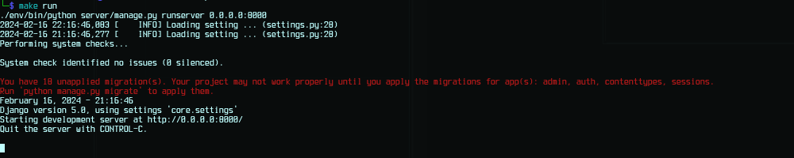
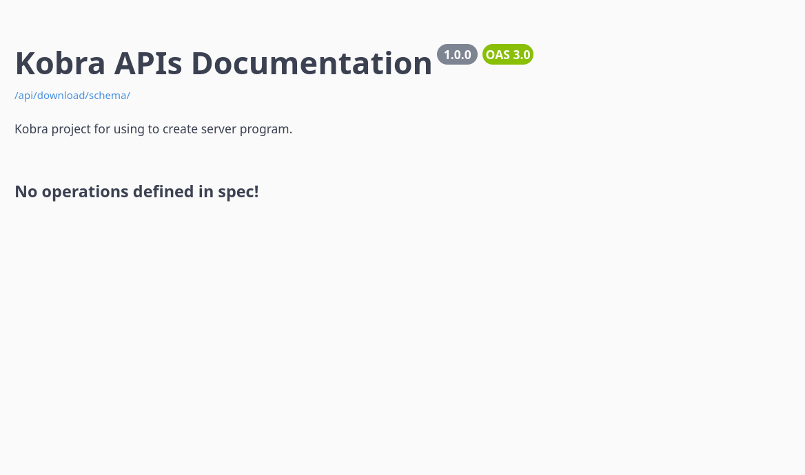

# Kobra


A custom server program based on the **Django framework** designed 
to allow a programmer to directly move to the implementation of 
an application's features without having to torture himself with other
time-consuming configuration or installation.

You can clone this repository everywhere you want in your machine,
with the following command lines:

```sh
# ~$
git clone https://github.com/mokira3d48/cobra.git myapp && cd myapp
```

In this cloned directory, you will see the following structure:

```
.
├── LICENSE
├── README.md
├── requirements.txt
└── server
    ├── core
    │   ├── asgi.py
    │   ├── __init__.py
    │   ├── settings.py
    │   ├── urls.py
    │   └── wsgi.py
    └── manage.py

2 directories, 9 files
```

This is the list of the installed features:
1. **Django REST Framework**: it's a powerful and flexible toolkit
for building Web APIs.
2. **drf-yasg**: for the generation of a documentation of the API in real
**Swagger/OpenAPI 2.0 specifications** from a **Django Rest Framework** API.
3. **Django CORS Headers**: it's a security mechanism that **allows one
domain to access** resources hosted on **another domain**.


<details id="table-content" open>
    <summary>Table des Contenus</summary>
    <ul>
        <li><a href="#1-dev-installation">1. Dev installation</a>
            <ul>
                <li><a href="#install-python3">1.1 Install python3</a></li>
                <li><a href="#install-venv">1.2 Install venv</a></li>
                <li><a href="#install-postgresql">1.3 Install PostgreSQL</a></li>
                <li><a href="#configuration">1.4 Configuration</a>
                    <ul>
                        <li><a href="#setting-virtual-environment">1.4.1 Setting virtual environment</a></li>
                        <li><a href="#creating-and-setting-of-postgresql-database">1.4.2 Creating and setting of PostgreSQL database</a>
                            <ul>
                                <li><a href="#a-env-config">a. .env settings</a></li>
                                <li><a href="#b-launching-the-server">b. Server settings</a></li>
                            </ul>
                        </li>
                    </ul>
                </li>
            </ul>
        </li>
        <li><a href="#launching-the-server">2. Launching the dev server</a></li>
    </ul>
</details>


## 1. Dev Installation
We must install three (03) programs:
1. **Python3** runtime
2. **Django** for Python 3;
3. Python virtual environment `venv`;
4. Database manager `PostgreSQL`;
5. Getting of project repository.

### 1.1. Install python3

```sh
# ~$
sudo apt install python3 python3-pip
```

You have to make sure of the version of python that is installed.
The version of python used is `python 3.10.9`.

### 1.2 Django for python3
In this version, you need to install the django package for your Python3. This package allows
you to use the `django-admin` command in your project.

```sh
sudo apt install python3-django
```

### 1.2. Install venv
You can install a python virtualenv program in two different ways.

```sh
# ~$
sudo apt install python3-venv
```

OR

```sh
# ~$
sudo pip3 install virtualenv
```

### 1.3. Install PostgreSQL

```sh
# ~$
sudo apt install postgresql postgresql-contrib
```

For using a *spacial database*, we can install the following extension:

```sh
# ~$
# PostGIS is an extension of PostgreSQL
# that allows to process the spacial data like the Polygons,
# the Points, ...
sudo apt install postgis
```


### 1.4 Configuration
1. Setting virtual environment;
2. Creating and setting of PostgreSQL database;
3. Dependences installation.

#### 1.4.1 Setting virtual environment
1. In your project root, if you have not already done so,
run one of the following commands to create a virtual environment.

```sh
# ~$
python3 -m venv env
```

OR

```sh
# ~$
virtualenv env -p python3
```

2. Launch environment

```sh
# ~$
source env/bin/activate
```

3. You must execute the following command to install the basic dependences:

```sh
# ~$
pip install -r requirements.txt
```


If you have warnings including the `coreschema` package that is deprecated,
then execute the following command line.

```sh
# ~$
pip install -r requirements.txt --use-pep517
```

#### 1.4.2 Creating and setting of PostgreSQL database
The following `SQL` command lines allow to create a `PostgreSQL`
database for your application:

```sh
# ~$
# To connect to PostgreSQL with ROOT user:
sudo su - postgres
```

```sh
# ~$
# To connect to default database (postgres)
psql
```

Given your database name is `cbrdb` and the username is `cobra`.

```sql
CREATE DATABASE cbrdb;
CREATE USER cobra WITH ENCRYPTED PASSWORD 'your-secret-password-here';
ALTER ROLE cobra SET client_encoding TO 'utf8';
ALTER ROLE cobra SET default_transaction_isolation TO 'read committed';
ALTER ROLE cobra SET timezone TO 'Europe/Paris';
GRANT ALL PRIVILEGES ON DATABASE cbrdb TO cobra;

-- configuration for testing database for Django
ALTER USER cobra CREATEDB;
-- ALTER ROLE cobra SUPERUSER;

-- connect to cbrdb.
\c cbrdb;

```

Give the access of the `public` schema to the user account of the application.

```sql
GRANT ALL ON SCHEMA public TO cobra;
```

For the spacial database, you must create the following extensions on it.

```sql
-- ...

-- Only you are using a spatial database
CREATE EXTENSION postgis;
```

Finally, disconnect from PostgreSQL by pressing `CTRL + D` twice.


##### a. .env settings
1. You have to create a `.env` file in the root of the server
from the `server/.env_example`:

```sh
cp server/.env_example server/.env
```

2. Insert the following information into `.env` file:

| FIELDS   | VALUES                    |
| ------   | --------------------------|
| DB_NAME  | cbrdb                     |
| USERNAME | cobra                     |
| PASSWORD | your-secret-password-here |
| HOST     | 127.0.0.1                 |
| PORT     | 5432                      |

Here are the contents of the file `.env`:

```
DB_NAME=cbrdb
USERNAME=cobra
PASSWORD=your-secret-password-here
HOST=127.0.0.1
PORT=5432

```

> If port `5432` does not work, then try port `5433`.

3. Execute the following command line, to apply the configs made in the
`server/.env` file.

```sh
source ./server/.env
```


##### b. Server settings
- Execute the following command lines to make migrations of models into
database. It's assumed that you are currently in project directory
root `cobra`.

```sh
# ~$
mkdir server/static;\
./server/manage.py makemigrations;\
./server/manage.py migrate
```

You will get the following result, if all works succefully :


- Then, create a super user that will be used to connect to admin space.

```sh
# ~$
./server/manage.py createsuperuser
```


### Lauching the server
To start server, you must execute the following command line:

```sh
# ~$
./server/manage.py runserver
```

The result is:


We cant go it at this local host link [](http://127.0.0.1:8000/) or [](http://localhost:8000). <br/>
You can change the IP address and the port of the server with the following command line:

```sh
# ~$
# With this command, we cant make the server listens
# on the IP address of your local network on the port 8080.
./server/manage.py runserver 0.0.0.0:8080
```

Or you can execute the following command contained in `Makefile`.

```sh
# ~$
make run
```

You will see:



All work with successfully ! <br/>
To access it in this cas, you must execute the following command line,
in first:

```sh
# ~$
# IF YOU ARE USING LINUX
# show your IP address of your machine, if it's connected
# to your local network for example.
ifconfig
```

> For the people using **Windows**, use `ipconfig` insted of the command line
> above.

We cant go it at this local host **http://yourip:8080**.




## Usage
For the differents usages, you can consult the different documentation
available [here](./docs/README.md).

1. PostGIS
2. Cross Origin Resource Sharing
3. Usage example of Django REST Framework
4. JWT authentication with Django REST Framework
5. API documentation programming
6. Using cache with apiview and viewsets

<br>
