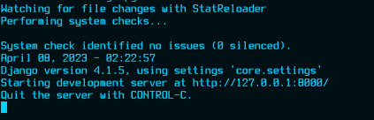

## 1. Dev Installation
We must install three (03) programs:
1. `Python3` runtime;
2. Python virtual environment `venv`;
3. Database manager `PostgreSQL`;
4. Getting of project repository.


<details id="table-content" open>
    <summary>Table des Contenus</summary>
    <ul>
        <li><a href="#11-install-python3">1.1 Install python3</a></li>
        <li><a href="#12-install-venv">1.2 Install venv</a></li>
        <li><a href="#13-install-postgresql">1.3 Install PostgreSQL</a></li>
        <li><a href="#14-configuration">1.4 Configuration</a>
            <ul>
                <li><a href="#141-setting-virtual-environment">1.4.1 Setting virtual environment</a></li>
                <li><a href="#142-creating-and-setting-of-postgresql-database">1.4.2 Creating and setting of PostgreSQL database</a>
                    <ul>
                        <li><a href="#a-env-settings">a. .env settings</a></li>
                        <li><a href="#b-launching-the-server">b. Server settings</a></li>
                    </ul>
                </li>
            </ul>
        </li>
        <li><a href="#15-lauching-the-server">1.5 Launching the dev server</a></li>
    </ul>
</details>

<div align="center">

[:house: **Retour à l'accueil**](../README.md)

</div>


### 1.1 Install python3

###### `>_ cmd@01:~$`
```sh
sudo apt install python3 python3-pip
```

You have to make sure of the version of python that is installed.
The version of python used is `python 3.9.16`.

### 1.2 Install venv
You can install a python virtualenv program in two different ways.

###### `>_ cmd@02:~$`
```sh
sudo apt install python3-venv
```

OR

###### `>_ cmd@03:~$`
```sh
sudo pip3 install virtualenv
```

### 1.3 Install PostgreSQL

###### `>_ cmd@04:~$`
```sh
sudo apt install postgresql postgresql-contrib libpq-dev
```


### 1.4 Configuration
1. Setting virtual environment;
2. Creating and setting of PostgreSQL database;
3. Dependences installation.


#### 1.4.1 Setting virtual environment
1. In your project root, if you have not already done so,
run one of the following commands to create a virtual environment.

###### `>_ cmd@06:~$`
```sh
python3 -m venv env
```

OR

###### `>_ cmd@07:~$`
```sh
virtualenv env -p python3
```

2. Launch environment

###### `>_ cmd@07:~$`
```sh
source env/bin/activate
```

3. You must execute the following command to install the basic dependences:

###### `>_ cmd@08:~$`
```sh
pip install -r requirements.txt
```


If you have warnings including the `coreschema` package that is deprecated,
then execute the following command line.

###### `>_ cmd@09:~$`
```sh
pip install -r requirements.txt --use-pep517
```

#### 1.4.2 Creating and setting of PostgreSQL database
The following `SQL` command lines allow to create a `PostgreSQL`
database for your application:

###### `>_ cmd@10:~$`
```sh
# To connect to PostgreSQL with ROOT user:
sudo su - postgres
```

###### `>_ cmd@11:~$`
```sh
# To connect to default database (postgres)
psql
```

Given your database name is `kbrdb` and the username is `kobra`.

###### `</> SQL [01]`
```sql
CREATE DATABASE kbrdb;
CREATE USER kobra WITH ENCRYPTED PASSWORD 'your-secret-password-here';
ALTER ROLE kobra SET client_encoding TO 'utf8';
ALTER ROLE kobra SET default_transaction_isolation TO 'read committed';
ALTER ROLE kobra SET timezone TO 'Europe/Paris';
GRANT ALL PRIVILEGES ON DATABASE kbrdb TO kobra;

-- configuration for testing database for Django
ALTER USER kobra CREATEDB;
-- ALTER ROLE kobra SUPERUSER;

-- connect to kbrdb.
\c kbrdb;

```

Give the access of the `public` schema to the user account of the application.

###### `</> SQL [02]`
```sql
GRANT ALL ON SCHEMA public TO kobra;
```

Finally, disconnect from PostgreSQL by pressing `CTRL + D` twice.


##### a. .env settings
1. You have to create a `.env` file in the root of the server
from the `server/.env_example`:

###### `>_ cmd@12:~$`
```sh
cp server/.env_example server/.env
```

2. Insert the following information into `.env` file:

| FIELDS   | VALUES                    |
| ------   | --------------------------|
| DB_NAME  | kbrdb                     |
| USERNAME | kobra                     |
| PASSWORD | your-secret-password-here |
| HOST     | 127.0.0.1                 |
| PORT     | 5432                      |

Here are the contents of the file `.env`:

```txt
DB_NAME=kbrdb
USERNAME=kobra
PASSWORD=your-secret-password-here
HOST=127.0.0.1
PORT=5432

```

> If port `5432` does not work, then try port `5433`.

3. Execute the following command line, to apply the configs made in the
`server/.env` file.

###### `>_ cmd@13:~$`
```sh
source ./server/.env
```


##### b. Server settings
- Execute the following command lines to make migrations of models into
database. It's assumed that you are currently in project directory
root `kobra`.

###### `>_ cmd@14:~$`
```sh
mkdir server/static; \
./server/manage.py makemigrations; \
./server/manage.py migrate
```

You will get the following result, if all works succefully :


- Then, create a super user that will be used to connect to admin space.

###### `>_ cmd@15:~$`
```sh
./server/manage.py createsuperuser
```


### 1.5 Lauching the server
To start server, you must execute the following command line:

###### `>_ cmd@16:~$`
```sh
./server/manage.py runserver
```

The result is:



We cant go it at this local host link [127.0.0.1:8000](http://127.0.0.1:8000/)
or [localhost:8000](http://localhost:8000). <br/>
You can change the IP address and the port of the server with the following
command line:

###### `>_ cmd@17:~$`
```sh
# With this command, we cant make the server listens
# on the IP address of your local network on the port 8080.
./server/manage.py runserver 0.0.0.0:8080
```

You will see:


All work with successfully ! <br/>
To access it in this cas, you must execute the following command line,
in first:

###### `>_ cmd@18:~$`
```sh
# IF YOU ARE USING LINUX
# show your IP address of your machine, if it's connected
# to your local network for example.
ifconfig
```

> For the people using **Windows**, use `ipconfig` insted of the command line
> above.

We cant go it at this local host **http://yourip:8080**.


